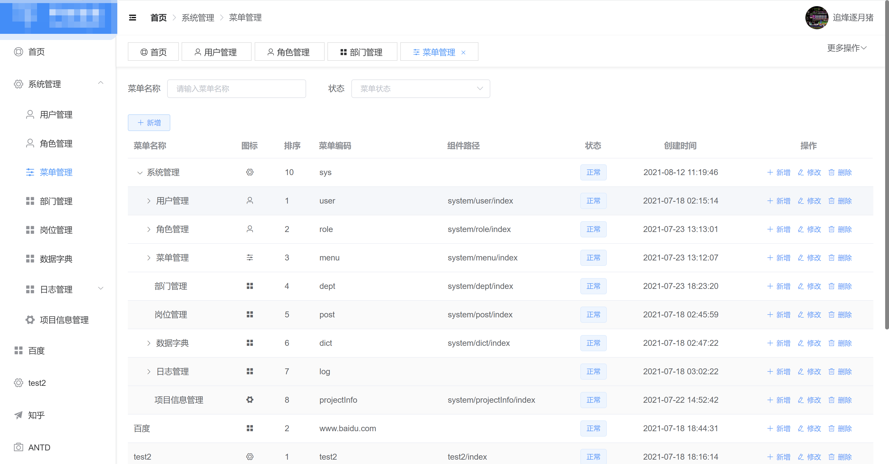

# JBM

[](https://www.apache.org/licenses/LICENSE-2.0)
[](https://gitee.com/numen06/JBM)
[](https://github.com/numen06/JBM)
[](https://www.jetbrains.com/?from=RuoYi-Cloud-Plus)
<br>
[]()
[]()
[]()
[]()

```
2021年9月开放独立的web管理界面
陆续上传集群使用说明，希望更多的开发者加入更新
联系邮箱；numen06@qq.com
```

### 说明

- Java Business Model(JBM)
- 适合中大型项目开发，全分布式架构统一平台管理
- 支持多租户，多项目管理

### 故事

- 由于框架诞生之初是初期期spring boot 1.0时代，所以有很多兼容性问题，在spring boot 2.0走红之后，JBM5.0全面升级融合个大主流中间件的starter
- 4.x以前版本主要基于dubbo分布式体系，5.0将重心转移到spring cloud
- 基于java spring boot 模块化企业级框架
- 主要由util;autoconfig;webjars等模块组成
- 基于Spring Boot原则轻量级封装，目前版本还在迭代，追求的是稳定性可靠性
- 本框架基于IoT目标业务诞生，所以追求的开发效率和性能的平衡
- 称为模块化主要集成了多种工具的优势，通过Spring的有机结合，在基础框架的基础上快速构建企业自有的体系
- 框架所有内容通过分布式结构连接，通过Dubbo,Rest等方式相互调用

### 技术路线

- JDK:JDK1.8+
- 核心框架：Spring Boot
- 安全框架：Spring Security
- 注册中心：Nacos
- 任务调度：Spring + Quartz + Zookeeper
- 持久层框架：MyBatis + MyBatis-Plus + JPA + Spring Data
- 文档性架构：MongoDB + minio
- 数据库连接池：Alibaba Druid
- 缓存框架：Redis + Guava
- 会话管理：Spring Session + Redis
- 日志管理：SLF4J+Log4j2+LogBack 日志收集
- 前端框架：Vue;Angular JS;Bootstrap;Jquery（独立项目）

### 项目组成

- jbm-cluster(分布式集群基础微服务)
- jbm-framework-core(框架基础类服务)
- jbm-framework-autoconfigure(spring boot插件集合整合多重技术框架，版本平衡最佳)
- jbm-framework-micro(微服务基础父集合)
- jbm-framework-dependencies(版本控制集合)

[☆jbm-framework-dependencies](https://github.com/numen06/JBM/tree/master/jbm-framework-dependencies)
为maven基础，标示框架内所有jar的版本，本框架已经消除大部分兼容性问题，为一次集成打下结实基础。
集成到项目的时候统一继承，即可实现JBM统一版本技术体系管理功能。

```
<parent>
    <groupId>com.jbm</groupId>
    <artifactId>jbm-framework-dependencies</artifactId>
    <version>7.1.0-SNAPSHOT</version>
</parent>
```

基础核心工具类，结合多重工具包和JBM针对解决Util

```
<dependency>
    <groupId>com.jbm</groupId>
    <artifactId>jbm-util</artifactId>
</dependency>
```

完成富有对数据操作的微服务功能，围绕针对实体操作的ORM架构体系，自动创建数据库表和对应的所有增删改查，简单的几行代码就能完成。
完成全自动生成代码模式，只需一键继承即可完成项目部署

```
#启动类添加自动生产代码注解,指定Entity的包和生成目录,自动生成C\S\M相关文件,并可以直接POST访问增删改查
@EnableCodeAutoGeneate(entityPackageClasses = {BigscreenView.class}, targetPackage = "com.jbm.cluster.bigscreen")
```

提升为framework等级，提升整体util实用程度，基于jodd和hutool轻量级封装，延续两个的版本生命力，提升使用开发力度

### Docker集群快速部署

集群部署之前需要中间件:Nacos,Redis等

1.部署平台中心服务

```
docker run -itd --restart=always --name jbm-cluster-platform-center -v /opt/app/jbm-cluster-platform-center:/root -p 7777:7777 --privileged=true registry.cn-hangzhou.aliyuncs.com/51jbm/jbm-cluster-platform-center --spring.profiles.active=jbm
```

2.部署权限认证服务

```
docker run -itd --restart=always --name jbm-cluster-platform-auth -p 5555:5555 --privileged=true registry.cn-hangzhou.aliyuncs.com/51jbm/jbm-cluster-platform-auth  --spring.profiles.active=jbm
```

3.部署文档服务

```
docker run -itd --restart=always --name jbm-cluster-platform-doc --privileged=true registry.cn-hangzhou.aliyuncs.com/51jbm/jbm-cluster-platform-doc --spring.profiles.active=jbm
```

4.部署网关服务

```
docker run -itd --restart=always --name jbm-cluster-platform-gateway -p 6666:6666 --privileged=true registry.cn-hangzhou.aliyuncs.com/51jbm/jbm-cluster-platform-gateway --spring.profiles.active=jbm
```

5.部署其他服务

```
#日志收集服务
docker run -itd --restart=always --name jbm-cluster-platform-logs -p 3312:3312 --privileged=true registry.cn-hangzhou.aliyuncs.com/51jbm/jbm-cluster-platform-logs --spring.profiles.active=jbm
#推送消息服务
docker run -itd --restart=always --name jbm-cluster-platform-push -p 3313:3313 --privileged=true registry.cn-hangzhou.aliyuncs.com/51jbm/jbm-cluster-platform-push --spring.profiles.active=jbm
```

一键部署方案请关注更新

## 业务功能

| 功能 | 介绍                                             |
|---|------------------------------------------------|
| 用户管理 | 用户是系统操作者，该功能主要完成系统用户配置。                        |
| 部门管理 | 配置系统组织机构（公司、部门、小组），树结构展现支持数据权限。                |
| 岗位管理 | 配置系统用户所属担任职务。                                  |
| 菜单管理 | 配置系统菜单，操作权限，按钮权限标识等。                           |
| 角色管理 | 角色菜单权限分配、设置角色按机构进行数据范围权限划分。                    |
| 字典管理 | 对系统中经常使用的一些较为固定的数据进行维护。                        |
| 参数管理 | 对系统动态配置常用参数。                                   |
| 通知公告 | 系统通知公告信息发布维护。                                  |
| 操作日志 | 系统正常操作日志记录和查询；系统异常信息日志记录和查询。                   |
| 登录日志 | 系统登录日志记录查询包含登录异常。                              |
| 文件管理 | 系统文件上传、下载等管理。                                  |
| 定时任务 | 在线（添加、修改、删除)任务调度包含执行结果日志。                      |
| 代码生成 | 启动自动生成后端MVCM代码的生成 。 |
| 系统接口 | 根据业务代码自动生成相关的api接口文档。                          |
| 服务监控 | 监视集群系统CPU、内存、磁盘、堆栈、在线日志、Spring相关配置等。           |
| 缓存监控 | 对系统的缓存信息查询，命令统计等。                              ||
| 连接池监视 | 监视当前系统数据库连接池状态，可进行分析SQL找出系统性能瓶颈。               |

### 贡献代码

欢迎各路英雄豪杰 `PR` 代码 请提交到 `dev` 开发分支 统一测试发版


